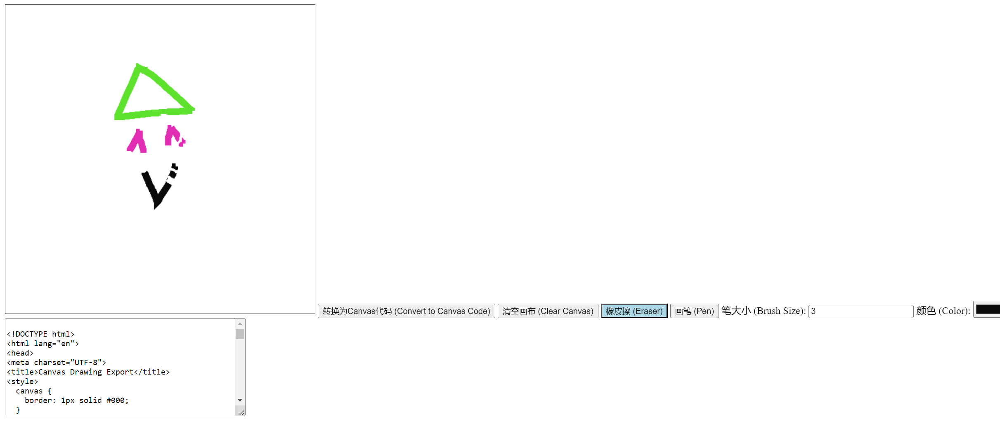

# html-painting

## Introduction

This project is a simple web application for drawing and erasing on a canvas element using JavaScript. It allows users to select brush size, color, draw with a pen, or erase content with an eraser.

这个项目是一个简单的网页应用，使用JavaScript在画布元素上进行绘制和擦除。它允许用户选择画笔大小、颜色，用画笔绘制，或者使用橡皮擦擦除内容。

## Features

- Draw freehand on the canvas.
- Erase content with an eraser.
- Adjust brush size and color.
- Convert drawing to Canvas code.

功能：

- 在画布上自由绘制。
- 使用橡皮擦擦除内容。
- 调整画笔大小和颜色。
- 将绘制内容转换为Canvas代码。

## How to Use

1. Open the HTML file in a web browser.
2. Use the buttons to select drawing or erasing mode.
3. Adjust brush size and color as desired.
4. Draw or erase on the canvas.
5. Optionally, convert the drawing to Canvas code.

使用方法：

1. 在网络浏览器中打开HTML文件。
2. 使用按钮选择绘制或擦除模式。
3. 根据需要调整画笔大小和颜色。
4. 在画布上进行绘制或擦除操作。
5. 可选地，将绘制内容转换为Canvas代码。

## License

This project is licensed under the MIT License - see the [LICENSE](LICENSE) file for details.

许可证

这个项目基于 MIT 许可证发布 - 查看 [LICENSE](LICENSE) 文件获取更多详情。
